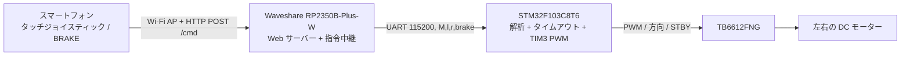

# RemoteCar Wi-Fi ラジコンカー

**言語：** [English（既定）](README.md) · [简体中文](README.zh-CN.md) · 日本語（このページ）

## プロジェクト概要

スマートフォンのブラウザーで操作する、2 モーターの差動駆動カーです。Waveshare **RP2350B-Plus-W**（RP2350、Pico 2 W 系の Wi-Fi 対応ハードウェア）が Wi-Fi アクセスポイントとジョイスティック画面を提供します。**STM32F103C8T6**（Blue Pill）は UART で左右の車輪指令を受け取り、**TB6612FNG** を介して 2 台の DC モーターを駆動します。現在の実装は Wi-Fi/HTTP とオープンループ PWM です。Bluetooth、映像伝送、エンコーダー、PID 制御は実装されていません。

## 構成と動作

制御層は[設計フローチャート](https://app.notion.com/p/3dbc2c8fcde68059b1d6f24b36ee3b40)を参考にしています。このリポジトリでは、Linux を動かす Raspberry Pi の代わりに RP2350 マイコンをゲートウェイとして使用します。



ファームウェアを書き込んで起動したら、スマートフォンを **`RC_Car`**（パスワード **`12345678`**）に接続し、**`http://192.168.4.1`** を開きます。画面にはジョイスティック、左右の指令値、通常/低速/高速モード、接続表示、押している間だけ有効な BRAKE ボタンがあります。前進、後退、カーブ、左右の車輪を逆方向に回すその場旋回ができます。ジョイスティックを離すと惰性停止指令を送ります。RP2350 は指令が **500 ms** 途絶えるとブレーキ指令を送信し、STM32 も有効な UART 指令が **300 ms** 途絶えると独立して短絡ブレーキをかけます。これらはコード上の動作であり、実測の速度や停止距離ではありません。

## 必要なハードウェア

| 部品 | 用途 |
| --- | --- |
| STM32F103C8T6 Blue Pill | モーター制御。ファームウェアは 8 MHz の外部水晶を想定 |
| Waveshare RP2350B-Plus-W | RP2350 Wi-Fi ゲートウェイと Web UI。設定済みのボード ID に対応するモデル |
| TB6612FNG モジュール | 2 チャンネルのモータードライバー |
| DC モーター 2 台、車輪 | 左右の駆動系 |
| モーター電源、安定化された MCU 電源、配線 | 各部品の定格電圧に合わせ、すべての GND を共有 |
| ST-Link、USB ケーブル | それぞれ STM32、RP2350 の書き込み用 |

## 配線方法

電源を切ってから配線してください。TB6612 の **VCC** を 3.3 V のロジック電源、**VM** をモーターとドライバーの定格に合うモーター電源につなぎます。**GND** はドライバー、STM32、RP2350、各電源で共通にします。両 MCU は適切に安定化した電源で給電し、モーター電圧を GPIO や 3.3 V 電源線へ直接接続しないでください。**AO1/AO2** は左モーター、**BO1/BO2** は右モーターにつなぎます。正の速度指令で逆走する車輪は、そのモーターの 2 本の配線を入れ替えるか、ソフトウェアでその側の符号を反転します。

| STM32 ピン / 周辺機能 | TB6612 ピン | 役割 |
| --- | --- | --- |
| PA6 / TIM3_CH1 | PWMA | 左 PWM |
| PA7 / TIM3_CH2 | PWMB | 右 PWM |
| PB12、PB13 | AIN1、AIN2 | 左の回転方向 |
| PB14、PB15 | BIN1、BIN2 | 右の回転方向 |
| PB5 | STBY | ドライバー有効化。ファームウェアが High に設定 |

UART の TX と RX は交差して接続し、GND を共有します。通信条件は **115200 baud、8N1、3.3 V ロジック**です。

| Waveshare RP2350B-Plus-W | STM32F103C8T6 | 役割 |
| --- | --- | --- |
| GP0 / Serial1 TX | PA10 / USART1 RX | STM32 への指令 |
| GP1 / Serial1 RX | PA9 / USART1 TX | 返信用に配線するが、現行アプリでは未使用 |
| GND | GND | 信号の共通 GND |

## PlatformIO（`pio`）でのビルドと書き込み

[PlatformIO Core](https://docs.platformio.org/en/latest/core/installation/index.html) と Git をインストールします。STM32 プロジェクトは公式 `ststm32` プラットフォームと `framework = stm32cube` を使用します。このプロジェクトで用いる標準 PlatformIO プラットフォームには Waveshare のボード定義がないため、`remote_car_controller/platformio.ini` は [maxgerhardt の Raspberry Pi プラットフォームフォーク](https://github.com/maxgerhardt/platform-raspberrypi)の `develop` を参照します。ボード ID は **`waveshare_rp2350b_plus_w`**、Arduino コアは `earlephilhower` です（[ボード対応の議論](https://github.com/maxgerhardt/platform-raspberrypi/discussions/118)、[Arduino-Pico の PlatformIO ガイド](https://github.com/earlephilhower/arduino-pico/blob/master/docs/platformio.rst)）。初回の依存パッケージ取得にはインターネット接続が必要です。リポジトリのルートから実行します。

```sh
pio pkg install -d remote_car_controller
pio run -d remote_car_controller
pio run -d remote_car
```

`pio pkg install -d remote_car_controller` は設定中の Git プラットフォームを読み込み、ボード定義、Arduino コア、ツールチェーンを取得します。古いキャッシュが原因で `Unknown board` と表示された場合は依存パッケージを更新して再実行します。

この標準外プラットフォームを PlatformIO のグローバルパッケージ領域へ明示的にインストールする場合は、`pio pkg install -g -p "https://github.com/maxgerhardt/platform-raspberrypi.git#develop"` を実行します。プロジェクト設定からも自動的に選択されます。

```sh
pio pkg update -d remote_car_controller
pio run -d remote_car_controller
```

コントローラーの環境名は `waveshare_ble400` ですが、実際のボードは `board = waveshare_rp2350b_plus_w` で指定されています。**ST-Link** を Blue Pill の SWD ピン、USB ケーブルを Waveshare ボードにつなぎ、次を実行します。

```sh
pio run -d remote_car -t upload
pio run -d remote_car_controller -t upload
```

RP2350 の設定は `upload_protocol = picotool` です。自動書き込みでボードが見つからないときは BOOT/ダウンロードモードに入れてください。USB シリアルポートを選択したうえで `pio device monitor -b 115200` を実行すると、RP2350 のデバッグ出力を確認できます。これは STM32 へ接続する UART とは別のシリアル通信です。この README は実機への書き込み成功を保証するものではありません。

## プロジェクト構成

```text
RemoteCar_wifi/
├── README.md                  英語、既定の入口
├── README.zh-CN.md            簡体字中国語
├── README.ja.md               日本語
├── remote_car/                STM32 下位コントローラー
│   ├── platformio.ini         ststm32 / Blue Pill / STM32Cube HAL / ST-Link
│   ├── include/main.h         ピンとタイムアウト定数
│   ├── include/stm32f1xx_hal_conf.h
│   ├── src/main.c             クロック、GPIO、PWM、UART 解析、モーター制御
│   └── src/stm32f1xx_it.c     HAL 割り込みの転送
└── remote_car_controller/     RP2350 上位コントローラー
    ├── platformio.ini         サードパーティー RP2350 プラットフォーム / Arduino-Pico
    ├── src/config.h           AP、UART、タイムアウトの設定
    ├── src/main.cpp           Wi-Fi AP、HTTP ルート、UART 中継
    └── src/webpage.h          組み込みジョイスティック画面
```

## 周辺機能の設定と主要アルゴリズム

STM32 は 8 MHz HSE を入力に **72 MHz** のシステムクロックを設定します。**TIM3** のチャンネル 1/2 は PA6/PA7 で **10 kHz** PWM を出力します（`PSC = 71`、`ARR = 99`）。**USART1** は割り込みで 1 バイトずつ受信し、PC13 は Low で点灯する指令表示 LED です。PB5 と PB12–PB15 はモーター制御 GPIO です。RP2350 は Wi-Fi AP、ポート 80 の HTTP サーバー、GP0/GP1 の **Serial1**、デバッグ出力用の USB **Serial** を使用します。

Web 画面ではジョイスティック位置を前進量 `forward` と旋回量 `turn` に変換し、8 px のデッドゾーンと通常/低速/高速の係数 **1 / 0.4 / 1.5** を適用します。`left = clamp(round((forward - turn) × 255 × factor), -255, 255)`、`right = clamp(round((forward + turn) × 255 × factor), -255, 255)` で左右の指令を求めます。正は前進、負は後退、左右で符号が異なればその場旋回です。操作中またはブレーキ中は **200 ms** ごとに指令を再送します。

ブラウザーは `/cmd` に `{"l":180,"r":80,"brake":0}` を POST し、RP2350 は改行で終わる `M,180,80,0\n` のような UART フレームへ変換します。車輪の値は **−255…255** に制限され、STM32 は絶対値をタイマーの比較値 **0…99** に線形変換します。ゼロ以外の速度では符号で `IN1/IN2` の向きを選択します。速度ゼロ時は `brake=1` で両入力を High にして短絡ブレーキ、`brake=0` で両入力を Low にして惰性停止します。STM32 は解析できない行を破棄しますが、`sscanf` による解析は厳密なプロトコル検証ではありません。初回の確認は車輪を浮かせ、`M,80,80,0` のような低速指令から始めてください。

[Notion の設計ページ](https://app.notion.com/p/3dbc2c8fcde68059b1d6f24b36ee3b40)には Linux Raspberry Pi や Bluetooth も含む広い構想が書かれています。この README はその階層図を参考にし、ピン、ボード、Web ルート、実装済みの機能はリポジトリのソースコードに基づいています。
