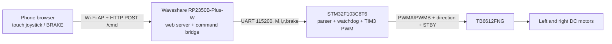

# RemoteCar Wi-Fi

**Languages:** English (this page) · [简体中文](README.zh-CN.md) · [日本語](README.ja.md)

## Overview

RemoteCar Wi-Fi is a two-motor, differential-drive car controlled from a phone browser. A Waveshare **RP2350B-Plus-W** board (RP2350, Pico 2 W-class Wi-Fi hardware) hosts a Wi-Fi access point and joystick page. An **STM32F103C8T6** (Blue Pill) receives wheel commands over UART and drives two DC motors through a **TB6612FNG**. The current firmware uses Wi-Fi/HTTP and open-loop PWM; Bluetooth, video, encoders, and PID control are not implemented.

## Architecture and result

The control layers follow the [project flowchart](https://app.notion.com/p/3dbc2c8fcde68059b1d6f24b36ee3b40); this repository implements the gateway with an RP2350 microcontroller rather than a Linux Raspberry Pi.



With the firmware running, connect a phone to **`RC_Car`** (password **`12345678`**) and open **`http://192.168.4.1`**. The embedded page shows a joystick, live left/right command values, Normal/Slow/Fast modes, a connection indicator, and a hold-to-brake button. The joystick supports forward, reverse, curved turns, and counter-rotating turns; releasing it sends a coasting stop. The RP2350 sends a brake after **500 ms** without a command, and the STM32 brakes independently after **300 ms** without a valid UART command. These are code-defined behaviors, not measured driving or stopping-distance results.

## Hardware

| Part | Purpose |
| --- | --- |
| STM32F103C8T6 Blue Pill | Real-time motor controller; 8 MHz external crystal expected by the firmware |
| Waveshare RP2350B-Plus-W | RP2350 Wi-Fi gateway and embedded web UI; use this exact board for the configured board ID |
| TB6612FNG module | Dual motor driver |
| Two DC motors and wheels | Left and right drive channels |
| Motor supply, regulated MCU supplies, wiring | Supply each device within its rated voltage; connect all grounds |
| ST-Link and USB cable | Flash the STM32 and RP2350 respectively |

## Wiring

Switch power off before wiring. First connect the TB6612 **VCC** to 3.3 V logic power, **VM** to a motor supply matched to the motors and driver, and **GND** to the common ground of the driver, STM32, RP2350, and supplies. Power the two microcontrollers from suitable regulated supplies; do not feed motor voltage into a GPIO or 3.3 V rail. The motor outputs **AO1/AO2** go to the left motor and **BO1/BO2** to the right motor. If the car drives backward for a positive command, swap that motor's two output wires or invert that side in software.

| STM32 pin / peripheral | TB6612 pin | Role |
| --- | --- | --- |
| PA6 / TIM3_CH1 | PWMA | Left PWM |
| PA7 / TIM3_CH2 | PWMB | Right PWM |
| PB12, PB13 | AIN1, AIN2 | Left direction |
| PB14, PB15 | BIN1, BIN2 | Right direction |
| PB5 | STBY | Driver enable; firmware sets it high |

Cross the UART lines and share ground. The firmware uses **115200 baud, 8N1, 3.3 V logic**.

| Waveshare RP2350B-Plus-W | STM32F103C8T6 | Role |
| --- | --- | --- |
| GP0 / Serial1 TX | PA10 / USART1 RX | Commands to STM32 |
| GP1 / Serial1 RX | PA9 / USART1 TX | Return path, wired but not currently used by the application |
| GND | GND | Common signal reference |

## Build and upload with PlatformIO (`pio`)

Install [PlatformIO Core](https://docs.platformio.org/en/latest/core/installation/index.html) and Git. The STM32 project uses the official `ststm32` platform with `framework = stm32cube`. The RP2350 project's `platformio.ini` already points to the [maxgerhardt Raspberry Pi platform fork](https://github.com/maxgerhardt/platform-raspberrypi) on `develop`, because the Waveshare board definition is absent from the standard platform package used by this project. Its board ID is **`waveshare_rp2350b_plus_w`**, and its Arduino core is `earlephilhower` ([board support discussion](https://github.com/maxgerhardt/platform-raspberrypi/discussions/118), [Arduino-Pico PlatformIO guide](https://github.com/earlephilhower/arduino-pico/blob/master/docs/platformio.rst)). The first dependency installation needs internet access:

```sh
pio pkg install -d remote_car_controller
pio run -d remote_car_controller
pio run -d remote_car
```

`pio pkg install -d remote_car_controller` reads the Git-based `platform` setting and installs its board definition, core, and toolchain. If PlatformIO reports an unknown board after an older cached fork was installed, update that project and retry:

To install that nonstandard platform explicitly in PlatformIO's global package storage, use `pio pkg install -g -p "https://github.com/maxgerhardt/platform-raspberrypi.git#develop"`; the project configuration still selects it automatically.

```sh
pio pkg update -d remote_car_controller
pio run -d remote_car_controller
```

The checked-in controller environment is named `waveshare_ble400`, although its actual board is `waveshare_rp2350b_plus_w`. To upload, connect an **ST-Link** to the Blue Pill SWD pins and a USB cable to the Waveshare board, then run:

```sh
pio run -d remote_car -t upload
pio run -d remote_car_controller -t upload
```

The RP2350 environment uses `upload_protocol = picotool`; put the board in BOOT/download mode if automatic upload does not detect it. `pio device monitor -b 115200` shows the controller's USB debug output after selecting its USB serial port; this is separate from its UART to the STM32. No hardware upload is verified by this README.

## Project layout

```text
RemoteCar_wifi/
├── README.md                  English (default)
├── README.zh-CN.md            Simplified Chinese
├── README.ja.md               Japanese
├── remote_car/                STM32 lower controller
│   ├── platformio.ini         ststm32 / Blue Pill / STM32Cube HAL / ST-Link
│   ├── include/main.h         Pins and timeout constants
│   ├── include/stm32f1xx_hal_conf.h
│   ├── src/main.c             Clock, GPIO, PWM, UART parser, motor control
│   └── src/stm32f1xx_it.c     HAL interrupt forwarding
└── remote_car_controller/     RP2350 upper controller
    ├── platformio.ini         Third-party RP2350 platform / Arduino-Pico
    ├── src/config.h           AP, UART, and timeout settings
    ├── src/main.cpp           Wi-Fi AP, HTTP routes, UART bridge
    └── src/webpage.h          Embedded joystick page
```

## Peripherals and control algorithm

The STM32 expects an 8 MHz HSE and configures a 72 MHz system clock. **TIM3** channels 1/2 run at **10 kHz** (`PSC = 71`, `ARR = 99`) on PA6/PA7. **USART1** receives one byte at a time by interrupt; PC13 is the active-low command LED. PB5 and PB12–PB15 are motor-control GPIOs. The RP2350 uses its Wi-Fi AP, an HTTP server on port 80, **Serial1** on GP0/GP1 for the STM32, and USB **Serial** for debug output.

The browser maps joystick displacement to forward/turn values, with an 8 px dead zone and Normal/Slow/Fast factors **1 / 0.4 / 1.5**. It computes `left = clamp(round((forward - turn) × 255 × factor), -255, 255)` and `right = clamp(round((forward + turn) × 255 × factor), -255, 255)`. Positive values drive forward and negative values drive backward; two opposite signs spin the car. During active steering or braking, the browser resends the command every **200 ms**.

The browser posts `{"l":180,"r":80,"brake":0}` to `/cmd`. The RP2350 converts it to a newline-terminated UART frame such as `M,180,80,0\n`. Both wheel values are bounded to **−255…255**; on the STM32, their magnitudes map linearly to **0…99** timer compare values. For a nonzero wheel speed, the sign selects the `IN1/IN2` direction. At zero, `brake=1` sets both inputs high for a short brake, while `brake=0` sets both low for coasting. The STM32 drops lines it cannot parse, but its `sscanf` parser is lightweight rather than strict JSON/protocol validation. For safe first testing, lift the wheels and begin with a low command such as `M,80,80,0`.

The [Notion design page](https://app.notion.com/p/3dbc2c8fcde68059b1d6f24b36ee3b40) describes a broader Raspberry Pi/BT concept. Its flowchart informs the layers above; the pin mapping, board selection, web routes, and implemented features here come from this repository's source files.
