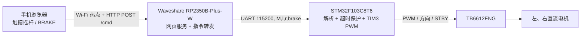

# RemoteCar Wi-Fi 遥控小车

**语言：** [English（默认）](README.md) · 简体中文（本页） · [日本語](README.ja.md)

## 项目简介

这是一个用手机浏览器控制的双电机差速小车。Waveshare **RP2350B-Plus-W**（RP2350，Pico 2 W 类 Wi-Fi 硬件）提供 Wi-Fi 热点和摇杆网页；**STM32F103C8T6**（Blue Pill）通过串口接收左右轮指令，使用 **TB6612FNG** 驱动两台直流电机。当前代码实现的是 Wi-Fi/HTTP 和开环 PWM；蓝牙、图传、编码器及 PID 尚未实现。

## 架构简述与项目效果

分层关系参考[方案流程图](https://app.notion.com/p/3dbc2c8fcde68059b1d6f24b36ee3b40)。本仓库把网关落实为 RP2350 单片机，而不是运行 Linux 的树莓派。



烧录并运行后，手机连接 **`RC_Car`**（密码 **`12345678`**），打开 **`http://192.168.4.1`**。网页有摇杆、左右轮当前指令值、普通/慢速/快速档、连接状态和按住生效的 BRAKE 按钮。可执行前进、后退、弧线转弯和原地转；松开摇杆会发送滑行停止。RP2350 在 **500 ms** 无指令时发刹车帧，STM32 在 **300 ms** 无有效串口帧时独立短刹。这些是源码定义的行为，文档不把它们描述为已测得的速度或刹车距离。

## 硬件要求

| 器件 | 用途 |
| --- | --- |
| STM32F103C8T6 Blue Pill | 实时电机控制；固件预期板上有 8 MHz 外部晶振 |
| Waveshare RP2350B-Plus-W | RP2350 Wi-Fi 网关与网页；需使用与配置中的板卡 ID 对应的型号 |
| TB6612FNG 模块 | 双路电机驱动 |
| 两台直流电机、车轮 | 左右驱动通道 |
| 电机电源、稳压 MCU 电源、连接线 | 电压符合各器件规格，所有 GND 共地 |
| ST-Link、USB 线 | 分别烧录 STM32 和 RP2350 |

## 接线教程

断电后接线。先将 TB6612 的 **VCC** 接 3.3 V 逻辑电源，**VM** 接与电机及驱动板规格匹配的电机电源，**GND** 与驱动板、STM32、RP2350 和各电源共地。两颗 MCU 应由合适的稳压电源供电，不要把电机电压直接接到 GPIO 或 3.3 V 电源轨。**AO1/AO2** 接左电机，**BO1/BO2** 接右电机。若正速度指令让某侧反向，可交换该侧电机两根线，或在软件中反转该侧符号。

| STM32 引脚 / 外设 | TB6612 引脚 | 功能 |
| --- | --- | --- |
| PA6 / TIM3_CH1 | PWMA | 左轮 PWM |
| PA7 / TIM3_CH2 | PWMB | 右轮 PWM |
| PB12、PB13 | AIN1、AIN2 | 左轮方向 |
| PB14、PB15 | BIN1、BIN2 | 右轮方向 |
| PB5 | STBY | 驱动使能，固件将其置高 |

串口的 TX/RX 要交叉，并确保共地。两端均使用 **115200 波特率、8N1、3.3 V 逻辑电平**。

| Waveshare RP2350B-Plus-W | STM32F103C8T6 | 功能 |
| --- | --- | --- |
| GP0 / Serial1 TX | PA10 / USART1 RX | 发往 STM32 的控制帧 |
| GP1 / Serial1 RX | PA9 / USART1 TX | 返回通道已接线，但当前应用未使用 |
| GND | GND | 信号共地 |

## 用 PlatformIO（`pio`）编译和烧录

安装 [PlatformIO Core](https://docs.platformio.org/en/latest/core/installation/index.html) 和 Git。STM32 工程使用官方 `ststm32` 平台及 `framework = stm32cube`。Waveshare 板卡定义不在本工程所用的标准 PlatformIO 平台包中，因此 `remote_car_controller/platformio.ini` 已指向 [maxgerhardt 的 Raspberry Pi 平台分支](https://github.com/maxgerhardt/platform-raspberrypi) `develop`，板卡 ID 是 **`waveshare_rp2350b_plus_w`**，Arduino 核心为 `earlephilhower`（见[板卡支持讨论](https://github.com/maxgerhardt/platform-raspberrypi/discussions/118)及[Arduino-Pico 的 PlatformIO 文档](https://github.com/earlephilhower/arduino-pico/blob/master/docs/platformio.rst)）。首次安装依赖需要网络。从本仓库根目录运行：

```sh
pio pkg install -d remote_car_controller
pio run -d remote_car_controller
pio run -d remote_car
```

`pio pkg install -d remote_car_controller` 会读取工程中的 Git 平台地址，安装板卡定义、Arduino 核心和工具链。若旧缓存造成 `Unknown board`，更新该工程的平台依赖后重试：

如需手动把这个非标准平台安装到 PlatformIO 全局包目录，可运行 `pio pkg install -g -p "https://github.com/maxgerhardt/platform-raspberrypi.git#develop"`；工程配置仍会自动选择它。

```sh
pio pkg update -d remote_car_controller
pio run -d remote_car_controller
```

控制器环境名虽然是 `waveshare_ble400`，实际板卡由 `board = waveshare_rp2350b_plus_w` 指定。把 **ST-Link** 接到 Blue Pill 的 SWD 引脚，把 USB 线接到 Waveshare 板，然后运行：

```sh
pio run -d remote_car -t upload
pio run -d remote_car_controller -t upload
```

RP2350 工程配置的是 `upload_protocol = picotool`；若自动烧录找不到板卡，可让板卡进入 BOOT/下载模式。选中其 USB 串口后，用 `pio device monitor -b 115200` 观察 RP2350 的调试输出；它与连接 STM32 的 UART 是两路不同的串口。本文档不声称已验证实体硬件的烧录。

## 项目结构

```text
RemoteCar_wifi/
├── README.md                  英文，默认入口
├── README.zh-CN.md            简体中文
├── README.ja.md               日文
├── remote_car/                STM32 下位机
│   ├── platformio.ini         ststm32 / Blue Pill / STM32Cube HAL / ST-Link
│   ├── include/main.h         引脚及超时常量
│   ├── include/stm32f1xx_hal_conf.h
│   ├── src/main.c             时钟、GPIO、PWM、UART 解析、电机控制
│   └── src/stm32f1xx_it.c     HAL 中断转发
└── remote_car_controller/     RP2350 上位机
    ├── platformio.ini         第三方 RP2350 平台 / Arduino-Pico
    ├── src/config.h           热点、串口、超时设置
    ├── src/main.cpp           Wi-Fi 热点、HTTP 路由、UART 转发
    └── src/webpage.h          内嵌摇杆网页
```

## 外设配置与核心算法

STM32 固件以 8 MHz HSE 为输入，配置 **72 MHz** 系统时钟。**TIM3** 通道 1/2 在 PA6/PA7 输出 **10 kHz** PWM（`PSC = 71`、`ARR = 99`）。**USART1** 通过中断逐字节接收；PC13 是低电平点亮的指令指示灯。PB5 和 PB12–PB15 是电机控制 GPIO。RP2350 使用 Wi-Fi 热点、80 端口 HTTP 服务、GP0/GP1 的 **Serial1** 与 STM32 通信，并通过 USB **Serial** 输出调试信息。

网页把摇杆位移转换为前进量 `forward` 和转向量 `turn`，采用 8 px 死区及普通/慢速/快速系数 **1 / 0.4 / 1.5**。算法为 `left = clamp(round((forward - turn) × 255 × factor), -255, 255)`，`right = clamp(round((forward + turn) × 255 × factor), -255, 255)`。正值代表前进，负值代表后退，两侧异号可原地转。操纵或刹车期间，网页每 **200 ms** 重发控制帧。

网页向 `/cmd` 发送 `{"l":180,"r":80,"brake":0}`；RP2350 将它转换为带真实换行符的 UART 帧，例如 `M,180,80,0\n`。左右轮值限幅至 **−255…255**，STM32 将其绝对值线性映射到定时器比较值 **0…99**。非零速度由符号决定 `IN1/IN2` 的方向；零速度时，`brake=1` 使两输入都为高电平，执行短刹，`brake=0` 使两输入都为低电平，执行滑行。STM32 会丢弃无法解析的行，但其 `sscanf` 解析器并非严格的协议校验器。首次调试建议架空车轮，从 `M,80,80,0` 这类低速指令开始。

[Notion 方案页](https://app.notion.com/p/3dbc2c8fcde68059b1d6f24b36ee3b40)描述的 Linux 树莓派/蓝牙属于较宽的设计方案。这里借用了其分层流程图；引脚、板卡、网页路由和已实现效果以本仓库源码为准。
